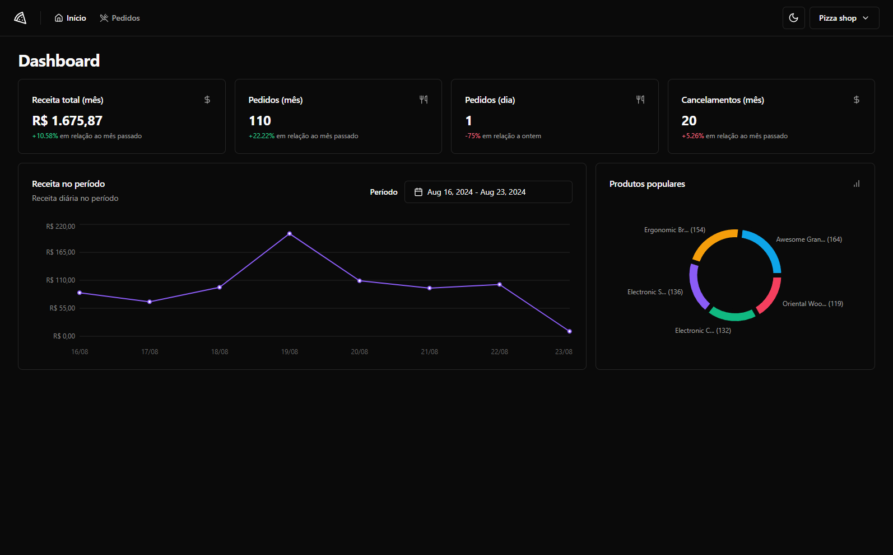
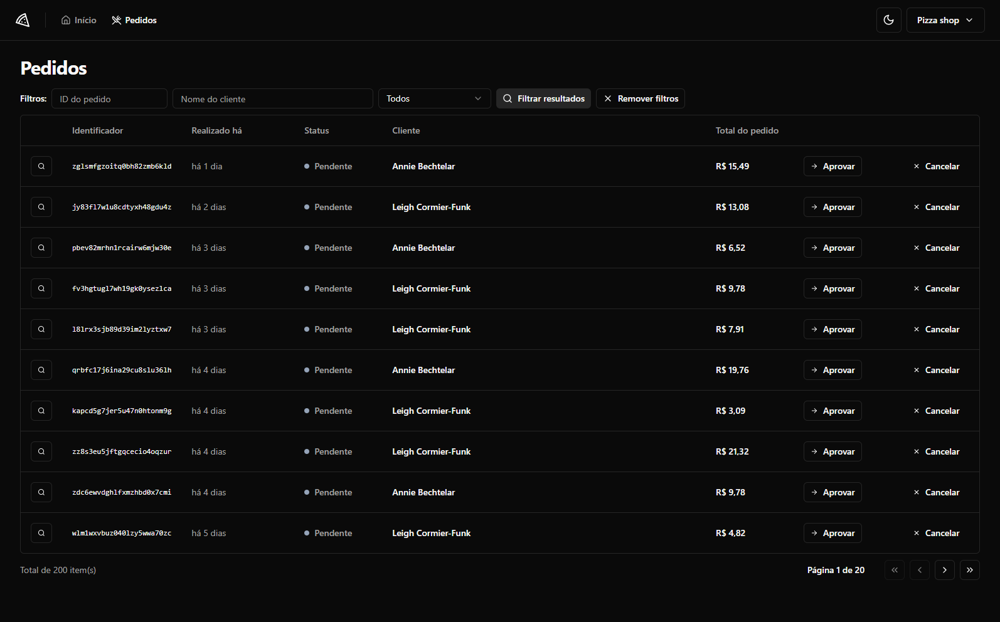

<h1 align="center">Pizza shop</h1>

<h2 align="center">Pizza shop is a app to manage a delivery store.</h2>




<br>

## Introduction

#### Project created with Vite, ReactJS and Typescript. This project is a part of the ReactJS course from [Rocketseat](https://www.rocketseat.com.br/).

<p>This application works as a dashboard to shopkeepers that owner a restaurant. The manager have access to resources like all orders and store metrics.</p>

<p>The app have a default design from shadcn/ui components. A library with pre-styled components using Tailwind.</p>

<p>I've learn how to use React Query to handle with front-end and back-end request, mocks to intercept the request and returning fictitious data to facilitate development and working with unitary and e2e tests.</p>

## Features

- Login with magic-link (The auth link is set to be send to back-end console.log).
- Register a new store.
- Update store profile.
- Total revenue on the current month and a comparison with previous month.
- Total orders on the current month and a comparison with previous month.
- Total orders on current day and a comparison with previous day.
- Total orders canceled on the current and a comparison with previous month.
- Most popular products.
- Check the revenue by period (Max 7 days).
- View all orders. There is a pagination that show a max of 10 orders per page.
- Filter by id, customer name and status.
- Update order status.
- Check order details.

## Technologies

#### Some library that I've used on develop.

- React router dom
- React hook from
- Zod
- React Query
- Shadcn/ui

#### Some library that I've used on test.

- Vitest
- MSW: Mock service work
- Testing library
- Happy dom
- Playwright

## Back-end

[Pizza Shop API](https://github.com/andresilveira1/pizza-shop-api)

## For run

#### Clone the repository and install dependencies.

```bash
git clone https://github.com/andresilveira1/pizza-shop-web.git

npm install
```

#### Run with back-end

```bash
npm run dev
```

<p>This manage account can be used. Remember that there will be a link on back-end console.log to confirm the access.</p>

admin@admin.com

#### Run without the back-end

```bash
npm run dev:test
```

#### Unit tests

```bash
npm run test
```

#### E2E tests

```bash
npx playwright test --ui
```

<br>

[](https://choosealicense.com/licenses/mit/)
